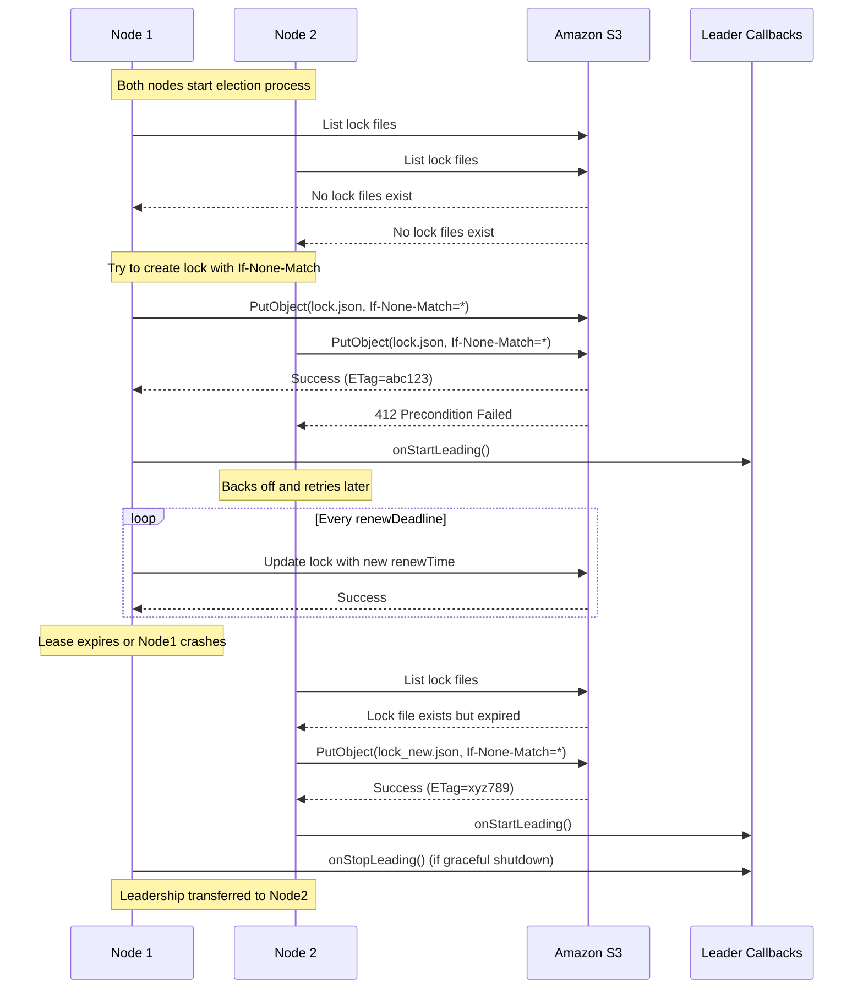

+++
date = '2025-02-02T21:00:00-00:00'
draft = true
title = 'Leader Election with S3'
+++

## Implementing Distributed Leader Election with S3 Conditional Writes: A Deep Dive

In distributed systems, selecting a leader among multiple nodes is a fundamental challenge. While traditional solutions like Apache ZooKeeper excel at this task, they introduce operational complexity and additional infrastructure costs. With Amazon S3's recent introduction of conditional writes, we can now implement leader election directly using S3, eliminating the need for external coordination services. Let me show you how we built a production-ready implementation.

## The Breakthrough: S3 Conditional Writes

Last week, AWS announced a game-changing feature for S3: conditional writes. The key addition is the `If-None-Match` header for PutObject operations. When you specify this header, S3 will only write the object if no file exists at that key - otherwise, you'll receive a 412 Precondition Failed response. While this might seem simple, it's exactly what we need to implement distributed locking.

## The Core Concept: Leader Election as a Locking Problem

The fundamental idea is elegant: nodes compete to create a lock file in S3, and whoever succeeds becomes the leader. Rather than continuously updating a single lock file (which could lead to race conditions), we create a new file for each leadership epoch. The lock file contains essential metadata in a JSON structure:

```json
{
    "holderIdentity": "node-123",
    "leaseDuration": "45s",
    "acquireTime": "2024-02-02T10:15:30.000Z",
    "renewTime": "2024-02-02T10:15:30.000Z",
    "leaderTransitions": 0
}
```

## Implementation Deep Dive

Let's walk through the key components of our implementation.

### The Lock Interface

At the heart of our system is the `ObjectStoreBasedLock` interface:

```java
public interface ObjectStoreBasedLock {
    Optional<LeaderElectionRecord> get() throws LeaderElectionException;
    void create(LeaderElectionRecord record) throws LeaderConflictWriteException;
    void update(String oldEtag, LeaderElectionRecord record) throws LeaderConflictWriteException;
    String identity();
    String describe();
}
```

This interface abstracts the core operations needed for leader election. The S3 implementation uses ETags for optimistic locking, ensuring consistency in our distributed environment.

### The Leader Election Process

The election process is managed by `DefaultLeaderElector`, which implements a robust state machine for leadership transitions. Here's the core algorithm:

1. **Attempt to Acquire Leadership**:
```java
protected final boolean canBecomeLeader(LeaderElectionRecord record) {
    return record.getHolderIdentity() == null ||
           record.getHolderIdentity().isEmpty() ||
           now().isAfter(record.getRenewTime()
                   .plus(leaderElectionConfig.getLeaseDuration()));
}
```

2. **Maintain Leadership** through periodic lease renewal:
```java
private CompletableFuture<Void> renewWithTimeout() {
    AtomicLong renewBy = new AtomicLong(System.currentTimeMillis() +
            leaderElectionConfig.getRenewDeadline().toMillis());

    return loop(completion -> {
        if (System.currentTimeMillis() > renewBy.get()) {
            completion.complete(null);
            return;
        }
        try {
            if (tryAcquireOrRenew()) {
                renewBy.set(System.currentTimeMillis() +
                        leaderElectionConfig.getRenewDeadline().toMillis());
            } else {
                completion.complete(null);
            }
        } catch (Exception e) {
            log.warn("Exception during renewal", e);
        }
    }, () -> leaderElectionConfig.getRetryPeriod().toMillis(), executor);
}
```

### Handling Clock Drift and Network Partitions

Like Gunnar mentions in his post, clock drift is a crucial consideration in distributed systems. Our implementation handles this through several mechanisms:

1. **Lease Duration**: We use configurable lease durations that can be tuned based on your environment's characteristics:
```java
LeaderElectionConfig config = LeaderElectionConfig.builder()
    .leaseDuration(Duration.ofSeconds(45))
    .renewDeadline(Duration.ofSeconds(45))
    .retryPeriod(Duration.ofSeconds(15))
    .build();
```

2. **Renewal Deadlines**: Leaders must renew their lease before the deadline, providing a buffer against network issues:
```java
if (System.currentTimeMillis() > renewBy.get()) {
    log.info("Renew deadline reached");
    completion.complete(null);
    return;
}
```

### Practical Usage

Here's a visual representation of how the leader election process works:



Here's how you can use this leader election implementation in your application:

```java
// Create leader callbacks
LeaderCallbacks callbacks = new LeaderCallbacks(
    () -> log.info("Starting to lead"),
    () -> log.info("Stopping leading"),
    id -> log.info("New leader elected: {}", id)
);

// Configure the leader election
LeaderElectionConfig config = LeaderElectionConfig.builder()
    .bucketName("your-bucket")
    .leaderKey("ha/leader")
    .leaseDuration(Duration.ofSeconds(45))
    .holderIdentity(UUID.randomUUID().toString())
    .retryPeriod(Duration.ofSeconds(15))
    .renewDeadline(Duration.ofSeconds(45))
    .releaseOnCancel(true)
    .leaderCallbacks(callbacks)
    .build();

// Create and start the leader elector
LeaderElector leaderElector = LeaderElectorFactory
    .createLeaderElector(config, ObjectStore.S3, s3Client);

leaderElector.start();
```

## Advantages Over Traditional Solutions

Our S3-based leader election offers several benefits:

1. **Simplified Infrastructure**: No need to maintain a separate coordination service.
2. **Cost-Effective**: Pay only for the S3 operations you use.
3. **Highly Available**: Leverages S3's inherent reliability.
4. **Scalable**: Works well from a handful to hundreds of nodes.

## Limitations and Considerations

While this approach is powerful, it's important to understand its limitations:

1. **Network Latency**: S3 operations have higher latency than ZooKeeper.
2. **Cost at Scale**: With many nodes and frequent elections, S3 API costs could add up.
3. **Eventually Consistent**: Like all distributed systems, leader election is eventually consistent.

## Future Improvements

Looking ahead, we're considering several enhancements:

1. Support for other cloud providers (Azure Blob Storage, Google Cloud Storage)
2. Integration with cloud provider-specific monitoring solutions
3. Automated cleanup of old leadership records

## Conclusion

S3's new conditional writes feature opens up exciting possibilities for distributed systems. This implementation demonstrates how we can build robust leader election without external coordination services. While it may not replace ZooKeeper for all use cases, it offers a compelling alternative for many scenarios, especially in cloud-native applications.

The complete implementation is available on GitHub under an open-source license. We welcome contributions and feedback from the community.

## References

1. AWS's announcement of S3 conditional writes (November 2024)
2. Gunnar Morling's excellent blog post on S3-based leader election
3. Martin Kleppmann's post on distributed systems coordination
4. The complete source code on GitHub

*Note: This implementation requires Java 11 or later.*